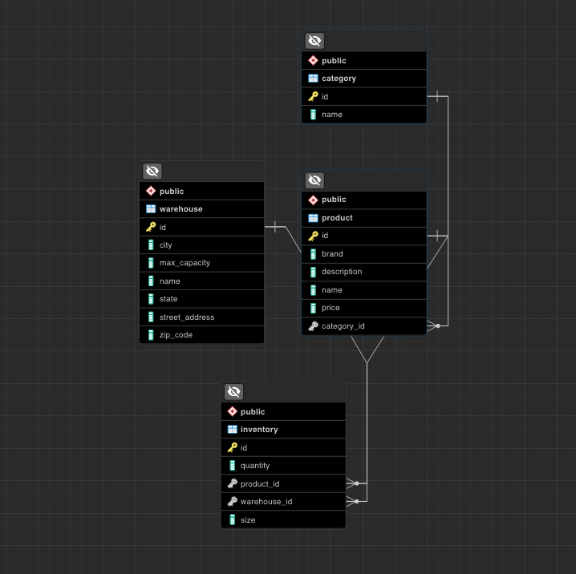

# Crag Supply Co Inventory Management System

## Project Overview

### Technology Stack
- **Backend:** Java with Spring Boot
- **Frontend:** React with TypeScript
- **UI Framework:** Ant Design (open-source)

### Project Description
This project involves building an inventory management system for Crag Supply Co, a climbing gear supply store. The system is designed to manage and track inventory across various product categories and warehouses.

### Entity-Relationship Diagram (ERD)

## Features

### Dashboard
The dashboard provides high-level overview of the inventory, including total inventory counts and total capacity. 

### Viewing Inventory
It provides three ways to view inventory:

1. **By Product Categories:** View inventory categorized by different types of climbing gear.
2. **By Warehouse:** View inventory based on different warehouse locations.
3. **All:** View all inventory items at once.

### Features in Each View
- **Breadcrumbs:** Navigate through different sections of the inventory easily.
- **Add/Edit/Delete:** Manage inventory items with options to add, edit, or delete records.
- **Sort & Filter Search:** Sort and filter inventory items based on various criteria.
- **Warehouse View Specific Features:**
  - **Current/Max Capacity:** View the current and maximum capacity of each warehouse.

### Responsiveness
The system is designed to be fully responsive, ensuring a seamless user experience across different devices and screen sizes.

### Edge Cases: Warehouse at capacity
- **IL1:** This warehouse is an example of a full warehouse. The system handles this by disabling the ability to add a new inventory item as it would exceed max capacity.